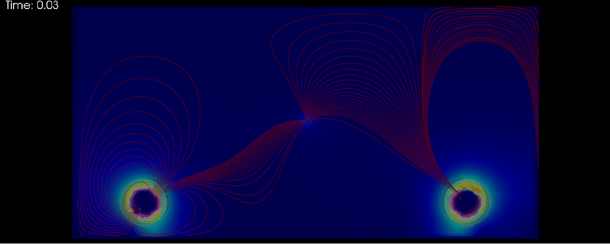

## 1 demo-4-foamer

This project is designed for individuals utilizing OpenFOAM for their simulation needs but may lack the programming expertise or the budget to fully leverage the framework's capabilities.  If you encounter any programming challenges or are unsure how to meet your specific needs in OpenFOAM, please don't hesitate to reach out with your questions. I am committed to turning your queries into demonstrative examples to guide and assist others in the community.

### 1.1 demo code for foamers
+ **1_repulsive-ball-overset**
   + **Feature**:
      + using overset/6dof
      + repulsive force starts acting when one ball is within a given distance from the other one
      + solver
         + oversetPimpleDyMFoam
         + tested on v2312
   

+ **2_bc_ode**
   + **Feature**:
      + implement a ode-goverened pressure boundary condtion
      + solve dP/dt ODE
      + solved pressure is applied to the bc
      + solver
         + simpleFoam
         + tested on openfoam11
   + **Demo**:

## 2 Support the Project

If you find this project useful and would like to support its development, consider making a donation. Your contributions will help cover costs such as hosting, software licenses, and development time, ensuring that the project can continue to grow and improve.

You can donate via [PayPal](https://www.paypal.com/). Every contribution, however small, is greatly appreciated!

Thank you for your support!
      