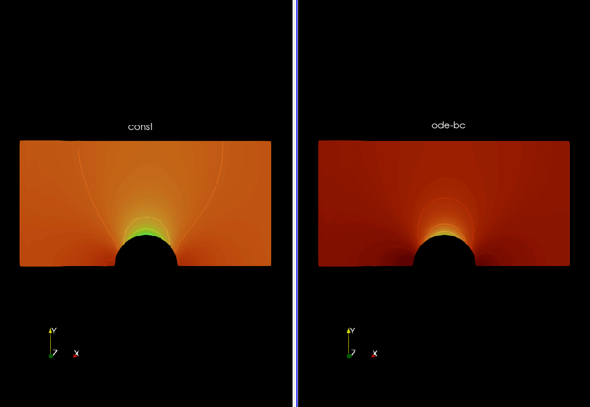

# demo-4-foamer
demo code for foamers
+ 1_repulsive-ball-overset
   + using overset/6dof
   + repulsive force starts acting when one ball is within a given distance from the other one

   

   + solver
      + oversetPimpleDyMFoam
      + tested on v2312

+ 2_bc_ode
   + implement a ode-goverened pressure boundary condtion
   + solve dP/dt ODE
   + solved pressure is applied to the bc

   + solver
      + simpleFoam
      + tested on openfoam11